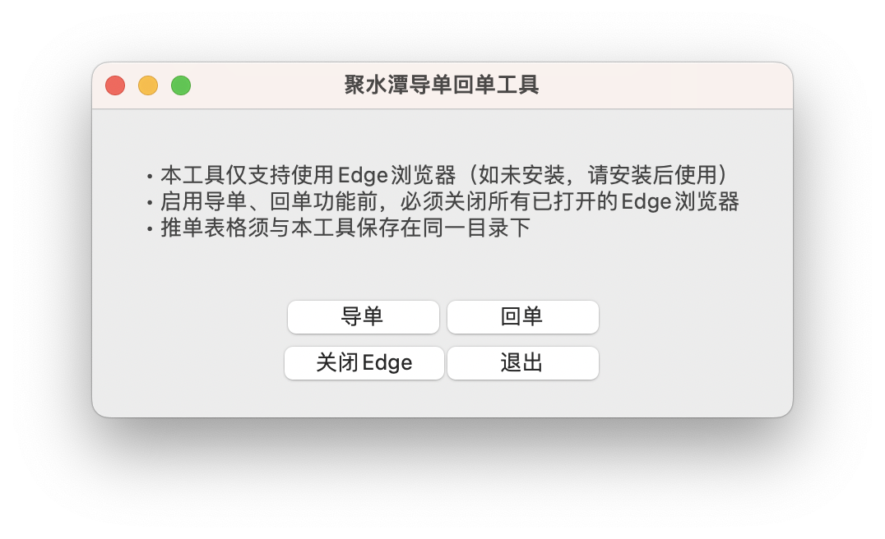
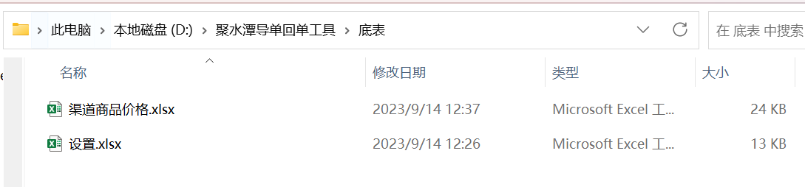
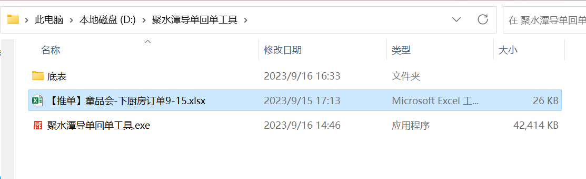
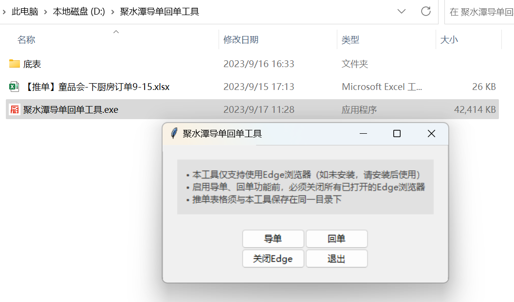
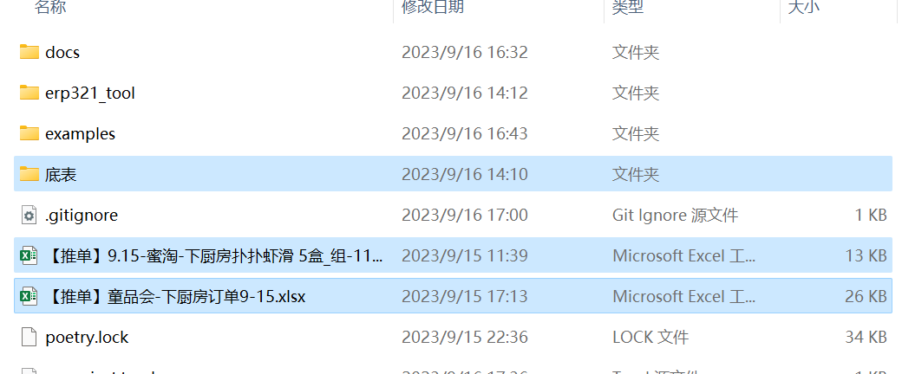
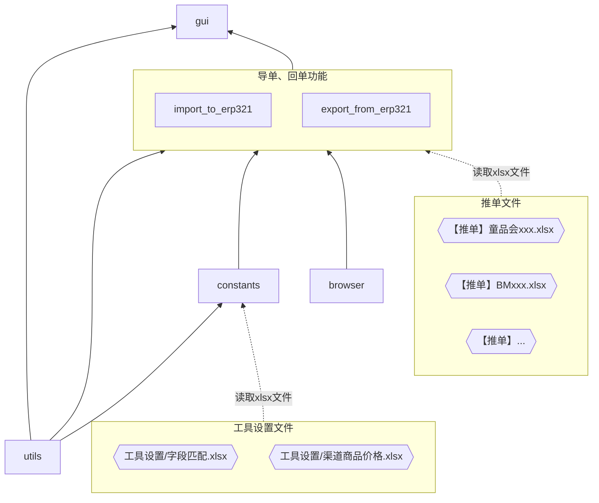

# 聚水潭导单回单工具

<p align="center">
  
</p>

- [聚水潭导单回单工具](#聚水潭导单回单工具)
  - [简介](#简介)
  - [安装](#安装)
  - [使用方法](#使用方法)
  - [开发说明](#开发说明)
    - [初始化开发环境](#初始化开发环境)
      - [使用macOS开发](#使用macos开发)
      - [使用Windows开发](#使用windows开发)
    - [启动与调试](#启动与调试)
      - [准备](#准备)
      - [启动图形界面](#启动图形界面)
      - [在命令行中运行单独功能](#在命令行中运行单独功能)
    - [构建可执行文件](#构建可执行文件)
  - [源代码说明](#源代码说明)
    - [各模块功能](#各模块功能)
    - [各模块依赖关系图](#各模块依赖关系图)

## 简介
聚水潭导单回单工具是一个提高“导单”和“回单”操作效率的软件，支持Windows与macOS系统。

“导单”是指把渠道发来的订单文件导入聚水潭系统，“回单”是指从聚水潭系统查询物流信息填入表格回复给渠道。

## 安装
目前软件由开发人员手动构建后人工分发给使用者。但持续部署（GitHub actions）是可运行的，未来如果有需要可以投入使用。

聚水潭导单回单工具是[绿色软件](https://zh.wikipedia.org/zh-cn/%E7%B6%A0%E8%89%B2%E8%BB%9F%E9%AB%94)，不需要专门的安装步骤，把软件储存在任何文件夹下，然后在文件夹中点击`聚水潭导单回单工具.exe`或`聚水潭导单回单工具.app`就能运行。

## 使用方法
1. 在软件所在文件夹中准备好2个工具设置文件：“`工具设置/字段匹配.xlsx`”和“`工具设置/渠道商品价格.xlsx`”，可以参照软件附带的`聚水潭导单回单工具/工具设置`或代码仓库的`examples/工具设置`中示例文件格式。
   <p></p>
2. 将渠道发来的订单文件按照特定格式（“`【推单】渠道名称.xlsx`”）命名，并放入软件所在文件夹中。
   <p></p>
3. 打开软件`聚水潭导单回单工具.exe`或`聚水潭导单回单工具.app`。
   <p></p>

   > ⚠️ 软件启动有点慢，根据电脑配置和系统不同，可能需要稍等不同的时间。
4. 软件需要自动控制Edge浏览器进行一些操作，所以导单或回单前需要先关闭Edge浏览器。可以点击软件的“关闭Edge”按钮关闭。
   > ⚠️ 如果Edge浏览器开启了“启动增强”功能，即使关闭浏览器窗口可能也无法完全退出浏览器，而这可能会导致软件功能不正常。可以参考[Edge浏览器的启动增强功能](https://guanjia.qq.com/knowledge-base/content/1234)把启动增强关闭再退出。
5. 点击“导单”按钮，软件会根据步骤2中的推单文件，生成对应的导单文件，并打开浏览器自动选择对应店铺进行导入。
6. 点击“回单”按钮，软件会根据步骤2中的推单文件，打开浏览器查询文件中订单的物流信息，在同一文件夹生成对应的回单文件。
7. 点击“退出”按钮可以关闭软件。

## 开发说明
### 初始化开发环境
#### 使用macOS开发
项目运行需要在系统中安装以下3个brew包。
```sh
brew install python python-tk poetry
```

然后安装项目依赖项，开发环境准备就绪。
```sh
poetry install
```

#### 使用Windows开发
如果没有在Windows中安装Python环境，推荐考虑通过[Scoop](https://scoop.sh)进行安装。
```pwsh
# 安装Scoop，需要在PowerShell中运行，cmd.exe中不能运行
Set-ExecutionPolicy RemoteSigned -Scope CurrentUser
irm get.scoop.sh | iex

# 安装Python
scoop install python
```

但选择其他任何方式来安装Python也是完全可以的。
<details>
  <summary>查看其它安装Python的方式</summary>

  其它可以选择的安装Python的方式包括：
  - 在[Python官网](https://www.python.org/downloads/windows/)下载安装包进行安装。
  - 通过[Microsoft Store](https://apps.microsoft.com/store/detail/python-311/9NRWMJP3717K)安装。
  - 通过[winget](https://learn.microsoft.com/zh-cn/windows/package-manager/winget/)安装：
    ```pwsh
    winget install python3
    ```
  - ……
</details>

项目使用[Poetry](https://python-poetry.org)管理依赖，请参阅[它的安装文档](https://python-poetry.org/docs/#installation)安装。
> ⚠️ 如果使用了前面介绍的Scoop，可以通过`scoop install poetry`安装。

然后安装项目依赖项，开发环境准备就绪。
```pwsh
poetry install
```

### 启动与调试
#### 准备
启动之前，需要参考[使用方法](#使用方法)中第1步的说明，在项目文件夹下准备工具设置文件和一些推单文件。可以从`examples`下复制出来。
<p></p>

#### 启动图形界面
运行以下命令，即可运行软件的图形界面。图形界面基于Python标准库内置的[`tkinter`](https://docs.python.org/zh-cn/3/library/tkinter.html)模块。
```sh
poetry run poe gui
```
> ⚠️ 这里也可以先通过`poetry shell`命令激活项目对应的virtualenv，后续就只需要运行`poe gui`。后面其它的以`poetry run poe`开头的命令也是类似的。

点击界面中的按钮就可以进行调试对应功能了。

#### 在命令行中运行单独功能
也可以不启动图形界面来调试“导单”和“回单”功能。
运行以下命令可以分别在命令行中执行“导单”和“回单”：
```sh
poetry run poe import # 运行“导单”功能
poetry run poe export # 运行“回单”功能
```
效果和启动图形界面点击相应按钮是一样的。


### 构建可执行文件
运行以下命令使用[pyinstaller](https://pyinstaller.org/en/stable/)构建当前平台的可执行文件，并生成一个压缩包。
```sh
poetry run poe release
```

构建产物在`dist`文件夹下。`dist/erp321-tool-windows.zip`、`dist/erp321-tool-macos.zip`文件是最终交付给用户使用的产物，包含可执行文件“`聚水潭导单回单工具.exe`”（Windows系统）或“`聚水潭导单回单工具.app`”（macOS系统），以及工具设置示例文件。

`poe release`是一系列构建任务的组合，细节可以查阅`pyproject.toml`中的具体内容。

## 源代码说明
### 各模块功能
+ `gui`

  调用标准库中的[`tkinter`](https://docs.python.org/zh-cn/3/library/tkinter.html)模块，生成用户界面，点击界面中的按钮可以执行导单、回单等功能。
+ `import_to_erp321`

  读取推单xlsx文件生成对应的导单文件，自动打开浏览器将导单文件上传。
+ `export_from_erp321`

  读取推单xlsx文件，获取到文件中的订单号，自动打开浏览器查询订单号对应的物流，然后填入xlsx中保存为新文件。
+ `constants`

  程序中使用到的常量，这些常量大部分是从工具设置文件中读取转换得到的。
+ `browser`

  调用[`playwright`](https://playwright.dev/python/docs/library)模块，打开电脑上安装的Edge浏览器。
+ `utils`

  工具方法，包括表格数据与常用数据结构互相转换、异步函数处理等通用功能。

  xlsx文件处理使用的库是[openpyxl](https://openpyxl.readthedocs.io/en/stable/)，没有使用pandas的原因是：pandas的依赖项太多、功能太丰富，会导致构建的可执行文件体积过大。

### 各模块依赖关系图


如果上面的关系图无法显示，可以[查看网页版](https://mermaid.live/view#pako:eNp9k8tu00AUhl9lNAsEkmN8SRzbiy4qlnQDrKhR5NqTZiR7xhqPVRfXUiIkkCpxU5UuQIKyQKqE1O4AkZSXSZ2Gt8Cum8TEpLszv__v3DyTQIe6CJqw69E9p2czDjafWASAMNrZZXbQA9gPKOMdm7gdFBfhtgWz83H2ejjpD7KPn_IgO_w8e3FhwWcFCOYEpx3EAlWRS7WEO11G_YqOiGuRf-plv4azL6fT41eXo-8lWSr3Z2e_ry7OxNgL4yTJe6ipFkzTkpj-PPkzOMqGL7OjweXox_RkvIqtccxT1NvCJIjy7rGHwu3pm9N86rLFm5ldzJDDMSXg4aObLSwAuag76b8rsUn__dW3r0XZ8Yc4jlc6X1LKKrW5dZtdXbWLolibpvYvwR0QceyFoNHYALsRLkxLoWYvPjuUhNwm_BbLMsPCXMg7jO6FiK3nKjsGDbGxcTA7H2Vvj4uRy2Uf_J-rXpm71cO9dWkWfUEB-oj5NnbzN5AUySzIe8hHFjTz0EVdO_K4BS2S5lY74vTxPnGgyVmEBBgFrs3RA2znd8Sfi4FNnlJaPUIzgTE0jWZLNNq6rEt6U5c1WRXgPjQVTRE1STFUXWoqkt7WtFSAz68TSGKrJbVbsqYZkqob7WZLgMjFnLKt8tFev930L9Fukkk)。
